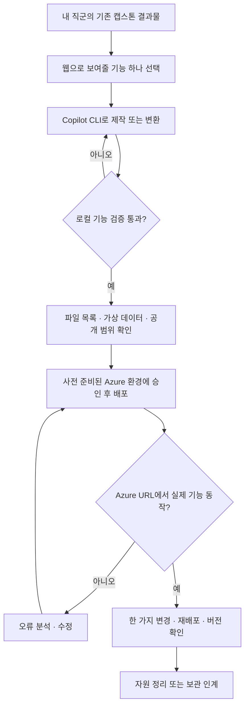

# Azure 배포 캡스톤 — 내가 만든 결과물을 URL로 공유하기

기존 직군별 Day 1·2를 마친 뒤 이어지는 **추가 과정**입니다. 기존 6~8시간에 배포 시간을 포함했다고 해석하지 않습니다. 교육 시간은 계정 준비와 리허설 후 확정합니다.

**목표:** Copilot CLI로 자신의 산출물을 웹으로 완성하고, Azure URL에서 확인한 뒤 수정·재배포한다.
Track 4를 먼저 수강할 필요는 없습니다. 배포 자동화·승인·운영은 Track 4에서 심화합니다.



## 과정 구성

| 순서 | 내용 | 결과물 |
| --- | --- | --- |
| 사전 | 강사의 [환경 준비](instructor.md), 수강생 도구·로그인 확인 | 배정받은 사이트와 로컬 설정 |
| 1 | [직군별 레시피](roles.md)에서 기존 결과물과 연결 | 기능 요구사항·완료 기준 |
| 2 | Copilot CLI로 웹 결과물 완성 | `index.html`과 필요한 정적 파일 |
| 3 | 로컬 확인 및 배포 대상 검토 | 성공·실패 입력의 실제 확인 |
| 4 | Static Web Apps 배포 | 접속 가능한 교육용 URL |
| 5 | 수정·재배포·정리 | 버전 변경 확인과 자원 종료 기록 |
| 선택 | [Python 서버 보고서](server-app.md) | 서버에서 계산하는 웹앱 |

**정적 웹은 Python/VBA를 실행하지 않습니다.** 보고서를 웹으로 표현하는 것과 서버에서 업무 로직을 실행하는 것은 다른 과정입니다. 기본 과정에는 DB·로그인·실제 고객 데이터·파일 업로드를 넣지 않습니다.

## 사전 준비

Windows PowerShell 7.2 이상을 기준으로 합니다.

- GitHub 계정, Copilot CLI 사용이 허용된 라이선스·조직 정책
- [Copilot CLI 설치](https://docs.github.com/en/copilot/how-tos/copilot-cli/set-up-copilot-cli/install-copilot-cli), Azure CLI, Node.js LTS
- SWA CLI: `npm install --global @azure/static-web-apps-cli`
- 강사가 배정한 Azure 계정·테넌트·구독, `rg-copilot-<prefix>` 그룹, `<prefix>-web` Free Static Web App
- 인터넷 공개를 허용한 가상 데이터만 사용한다는 확인

```powershell
copilot --version
az --version
node --version
swa --version
az login --tenant "<강사가 지정한 테넌트 ID>"
```

Copilot CLI 안에서는 필요하면 `/login`으로 GitHub에 로그인합니다. GitHub 로그인과 Azure 로그인은 별개입니다.
로그인 화면의 비밀번호·인증 코드·배포 토큰은 채팅에 붙여넣지 않습니다.

## 1. 작업 폴더와 설정

아래 명령은 저장소 루트에서 실행합니다. `student01`은 자신의 배정 코드로 변경합니다.

```powershell
New-Item -ItemType Directory -Path .\learners\student01
Copy-Item -LiteralPath .\09-azure-capstone\examples\starter\index.html -Destination .\learners\student01\index.html
Copy-Item -LiteralPath .\09-azure-capstone\lab.example.json -Destination .\09-azure-capstone\lab.local.json
```

`lab.local.json`에 강사가 준 구독·테넌트·그룹·사이트 이름을 입력합니다. 비밀 키를 넣는 파일이 아닙니다.
예제의 0으로 된 ID는 실행 전에 바꿔야 합니다. 로컬 설정과 `learners`는 Git 추적에서 제외됩니다.

PM은 기존 `prototype.html`을 `index.html`로 복사해서 시작해도 됩니다.
[완성 예시](examples/books/index.html)는 검색·도서 상세·독서 기록 3화면을 제공합니다.
독서 기록은 현재 탭의 메모리에만 유지되며 실제 대출 서비스가 아닙니다.

## 2. Copilot CLI로 만들기

작업 폴더에서 `copilot`을 실행합니다. 폴더 신뢰는 해당 실습 폴더에만 허용합니다.

```text
나는 비개발자이고, 이 폴더의 index.html을 업무 프로토타입으로 완성하려고 해.
대상 직군과 요구사항: [roles.md에서 내 직군의 요구사항 입력]
HTML/CSS/JavaScript만 사용하고 외부 API·로그인·DB·추적 스크립트는 넣지 마.
가상 데이터임을 화면에 표시하고, 키보드와 모바일에서도 사용할 수 있게 해.
먼저 구현 계획과 확인할 기능을 설명해. 아직 배포하거나 유료 자원을 만들지는 마.
계획을 검토한 다음 구현하고, 실제 확인하지 않은 동작은 확인했다고 말하지 마.
```

직군별 산출물을 읽게 할 때에는 실습용으로 만든 파일만 지정합니다. 실제 사내 문서를 통째로 올리지 않습니다.
도구 실행 승인에서 파일 변경·명령 실행의 목적을 확인합니다. 포괄적 자동 승인은 사용하지 않습니다.

## 3. 로컬 확인

정적 HTML은 브라우저로 직접 열어 확인할 수 있습니다. 모듈·파일 읽기 등 HTTP가 필요한 앱은 Copilot에게 **로컬에만 바인딩하는 미리보기 서버**를 요청하고, 종료 방법도 받습니다.

- [ ] 핵심 기능 하나가 요구사항대로 동작한다.
- [ ] 잘못된 입력·빈 검색 결과·중복 클릭을 처리한다.
- [ ] 숫자와 합계는 손으로 계산한 결과와 일치한다.
- [ ] 모바일 너비에서도 조작 가능하다.
- [ ] 브라우저 개발자 도구에 실행 오류가 없다.
- [ ] 실제 데이터·토큰·내부 주소·추적 도구가 포함되지 않았다.

완성 예시에서는 `기획` 검색 → 도서 상세 → 읽은 책 기록 → 내 독서 기록 순서로 확인합니다.
같은 책을 두 번 눌러도 기록이 중복되지 않고, 없는 검색어에는 빈 결과를 표시해야 합니다.

## 4. 배포 계획 → 승인 → 실행

저장소 루트의 새 PowerShell 터미널에서 실행합니다.

```powershell
.\09-azure-capstone\Deploy-Static.ps1 `
  -ConfigPath .\09-azure-capstone\lab.local.json `
  -SitePath .\learners\student01
```

기본 실행은 **오프라인 계획**만 출력합니다. Azure에 요청하거나 파일을 업로드하지 않습니다.
폴더에 숨김 파일·심볼릭 링크·정적 웹 파일이 아닌 파일이 있으면 중단합니다.
자격 증명 검사는 일부 알려진 패턴만 확인하므로, 파일의 공개 적합성을 사람이 반드시 검토해야 합니다.

```text
Deploy-Static.ps1의 오프라인 계획을 실행하고 업로드할 파일 목록을 설명해.
승인 전에는 -Apply를 붙이지 마. 설정의 구독과 사이트가 내 배정 정보와 맞는지 확인해.
```

내용을 검토한 뒤에만:

```powershell
.\09-azure-capstone\Deploy-Static.ps1 `
  -ConfigPath .\09-azure-capstone\lab.local.json `
  -SitePath .\learners\student01 -Apply
```

스크립트는 테넌트·구독·교육 태그·기존 Free 사이트를 확인하고 게시 승인을 받습니다.
필요한 배포 토큰은 프로세스 환경변수로만 전달하고 기존 값으로 복원합니다.
`--print-token`, 토큰 직접 붙여넣기, Git 커밋은 사용하지 않습니다.
SWA의 `production`은 **이 교육 사이트의 기본 배포 슬롯**이며 회사 운영 환경을 의미하지 않습니다.

## 5. URL 확인과 재배포

출력된 HTTPS URL을 열고 로컬에서 확인한 시나리오를 다시 수행합니다.
배포 성공 메시지나 HTTP 200만으로 완료 처리하지 않습니다.

```text
핵심 기능은 유지하고 제목 또는 안내 문구를 바꿔줘.
화면의 배포 버전은 lab-v2로 변경해.
로컬 검증과 배포 계획까지만 수행하고 재배포 승인을 기다려.
```

승인 후 같은 명령으로 재배포합니다. Azure URL에서 새 문구와 `lab-v2`를 확인하고 기존 기능도 다시 사용합니다.

## 6. 완료 및 정리

- [ ] Azure URL에서 핵심 기능을 직접 사용했다.
- [ ] 수정 후 재배포한 버전이 표시된다.
- [ ] 공개된 파일과 데이터가 실습 범위를 벗어나지 않는다.
- [ ] 강사에게 URL, 확인한 기능, 보관 필요 여부를 전달했다.
- [ ] 강사가 배정된 사이트를 삭제했거나 보관 책임자·종료일을 지정했다.

수강생에게 리소스 그룹 전체 삭제 명령을 제공하지 않습니다. 공유 자원은 강사가 정리합니다.
파일을 정적 웹에 배포했다고 실제 사내 업무 서비스로 사용할 준비가 된 것은 아닙니다.

## 막혔을 때

| 증상 | 확인 순서 |
| --- | --- |
| `copilot`·`az`·`swa`를 찾지 못함 | 설치 여부와 PATH 확인 후 터미널 재시작 |
| 로그인·구독·태그 오류 | 배정 정보와 현재 계정 확인 → 강사에게 권한 요청 |
| 파일 형식 차단 | 저장소 전체가 아니라 `index.html`이 있는 전용 사이트 폴더인지 확인 |
| 404·화면 없음 | 배포 폴더의 `index.html`, 경로 대소문자, 상대 경로 확인 |
| 배포 후 이전 화면 | 올바른 사이트 URL인지 확인 → 강력 새로고침 → 버전 문구 확인 |
| 숫자·기능 오류 | 배포 문제가 아닌 로컬 구현 문제인지 재현하고 수정 |

오류를 AI에 전달할 때는 토큰·개인정보·사내 주소를 제거한 메시지만 사용합니다.

다음 과정: [Track 4 — Actions 기반 자동화·운영](https://github.com/Ai-Advanced/Copilot-Advanced-Azure-DevOps)
