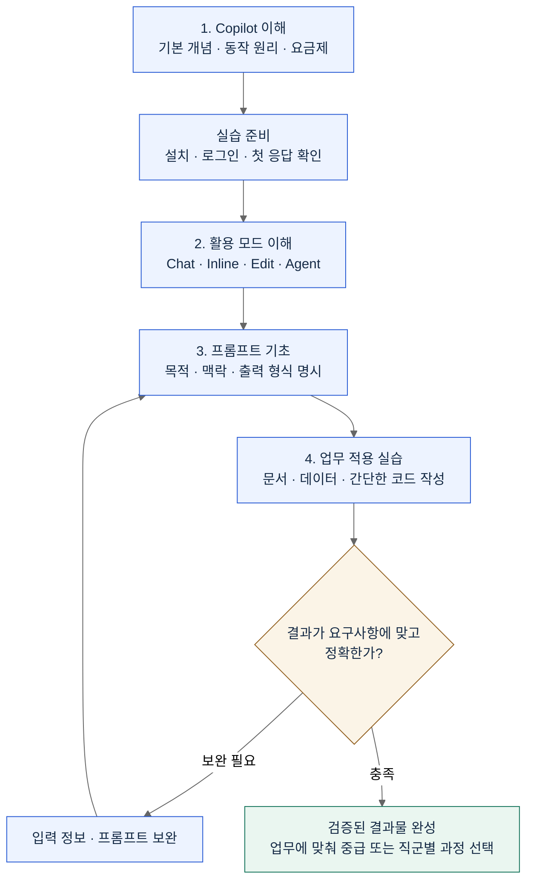
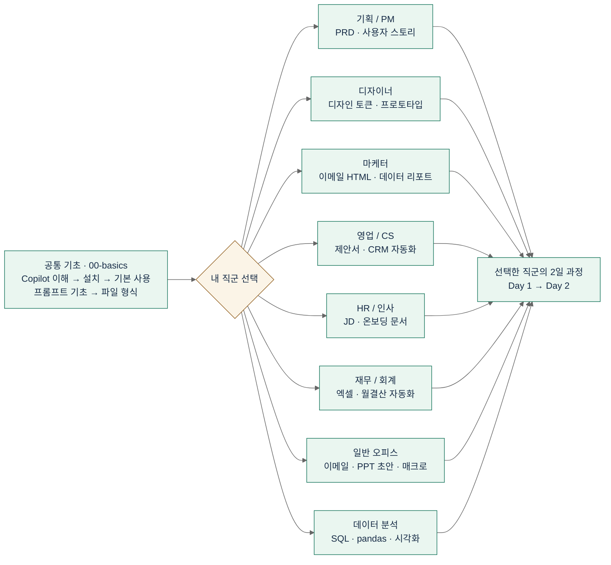
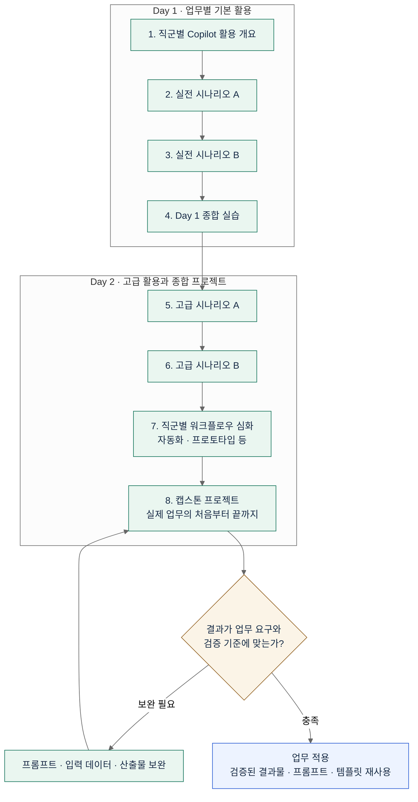

# Copilot for Non-Developers

> **비개발자를 위한 GitHub Copilot 실무 활용 커리큘럼**
> 직군별 2일 심화 과정 · 각 6~8시간 · 한국어

## 전체 교육 flow

[초급 교육 참고 흐름](#basic-curriculum-flow) · [직군별 2일 심화 흐름](#role-curriculum-flow)

<a id="basic-curriculum-flow"></a>

### 초급 교육 참고 흐름

교육 제안서의 초급 트랙은 **Copilot 이해 → 활용 모드 → 프롬프트 → 업무 적용** 순서로 진행합니다.
초급 전용 저장소와 구분하여, 이 저장소의 [`00-basics/`](00-basics/README.md)를 설치·기본 사용·프롬프트의 **공통 참고 자료**로 연결합니다.
기존 공통 기초 교재는 비개발자 관점의 **Tab · Chat · Inline Chat** 중심이며, 아래 흐름에 있는 **Edit · Agent 모드의 전용 실습 교재는 포함하지 않습니다.**



| 공통 참고 자료 | 연결되는 학습 내용 |
|---|---|
| [Copilot 개요](00-basics/01-copilot-overview.md) | 기본 개념 · 업무 활용 예시 |
| [설치와 첫 실행](00-basics/02-installation.md) | 실습 환경 준비 |
| [기본 사용법](00-basics/03-basic-usage.md) | Tab · Chat · Inline Chat |
| [프롬프트 기초](00-basics/04-prompt-basics.md) | 좋은 질문 · 3S 원칙 |
| [업무 파일 형식](00-basics/05-file-types-nondev.md) | Markdown · CSV · JSON · SQL 등 |

<a id="role-curriculum-flow"></a>

### 직군별 2일 심화 흐름

**공통 기초를 먼저 이수한 뒤, 8개 직군 중 자신의 업무에 맞는 한 과정을 선택**합니다.
8개 직군을 모두 순서대로 수강하는 과정이 아닙니다.

#### 1. 공통 기초 → 직군 선택



시작하기: [공통 기초 5개 문서](00-basics/README.md) · [직군별 폴더와 결과물](#커리큘럼-지도)

#### 2. 선택한 직군의 Day 1 → Day 2 → 업무 적용

아래는 모든 직군이 공유하는 학습 구조입니다. 실제 시나리오·고급 활용 주제는 각 직군의 README와 `day1/`, `day2/` 문서에서 확인하세요.



---

## 이 커리큘럼이 필요한 이유

GitHub Copilot은 "코드 자동완성 도구"로 알려져 있지만, 실제로는 **텍스트/표/데이터를 다루는 모든 직군의 반복 업무**를 극적으로 줄여주는 도구입니다.

| 오해 | 실제 |
|------|------|
| "코드를 짜야만 쓸 수 있다" | Markdown, SQL, 엑셀 수식, HTML 이메일, JSON, YAML도 자동 생성 |
| "개발자만 필요하다" | 기획서·JD·제안서·리포트·대시보드 스펙 모두 활용 가능 |
| "복잡한 세팅이 필요하다" | VS Code + Copilot 확장 = 5분 설정 |
| "AI를 못 믿는다" | 검증하는 법을 배우면 오히려 실수 방지 |

**이 커리큘럼의 원칙**
1. 이론 20% + 실습 80% — 손으로 직접 해봐야 남습니다
2. 각 직군의 **진짜 업무 시나리오** 기반 (가짜 튜토리얼 X)
3. 프롬프트는 그대로 복사해서 쓸 수 있는 형태로 제공
4. AI 결과를 **검증하는 습관**을 함께 훈련

---

## 커리큘럼 지도

### Step 0. 공통 기초 (필수 선행, 약 1시간)

모든 직군이 시작 전에 반드시 완료합니다.

→ [00-basics/](./00-basics/)

### Step 1. 직군별 2일 심화 과정

자기 직군 폴더로 이동해서 `day1/` → `day2/` 순서로 진행합니다.

| # | 직군 | 폴더 | 주요 결과물 |
|---|------|------|-------------|
| 1 | 기획 / PM | [01-planning-pm](./01-planning-pm/) | PRD, 사용자 스토리, 회의록→JIRA, 프로토타입 |
| 2 | 디자이너 | [02-designer](./02-designer/) | 디자인 토큰, 컴포넌트 스펙, HTML/CSS 프로토타입 |
| 3 | 마케터 | [03-marketer](./03-marketer/) | GA 이벤트, 이메일 HTML, SQL 데이터 추출, 리포트 |
| 4 | 영업 / CS | [04-sales-cs](./04-sales-cs/) | 제안서, 응대 스크립트, CRM 자동화, 매출 리포트 |
| 5 | HR / 인사 | [05-hr](./05-hr/) | JD, 인터뷰 질문, 온보딩 문서, HR 데이터 자동화 |
| 6 | 재무 / 회계 | [06-finance](./06-finance/) | 엑셀 수식/VBA, 재무 리포트, 월결산 자동화 |
| 7 | 일반 오피스 워커 | [07-office-worker](./07-office-worker/) | 이메일, PPT 초안, 반복 업무 매크로 |
| 8 | 데이터 분석가 (비개발) | [08-data-analyst](./08-data-analyst/) | SQL, pandas 기초, 시각화, 대시보드 스펙 |

---

## 각 직군 폴더 구조

모든 직군 폴더는 동일한 구조를 따릅니다:

```
XX-직군명/
├── README.md              # 2일 커리큘럼 개요 + 학습 목표
├── day1/                  # Day 1 (3~4시간)
│   ├── 01-*.md            # 직군별 Copilot 활용 개요
│   ├── 02-*.md            # 실전 시나리오 A
│   ├── 03-*.md            # 실전 시나리오 B
│   └── 04-lab.md          # Day 1 종합 실습
├── day2/                  # Day 2 (3~4시간)
│   ├── 05-*.md            # 고급 시나리오 A
│   ├── 06-*.md            # 고급 시나리오 B
│   ├── 07-*.md            # 워크플로우 자동화
│   └── 08-capstone.md     # 캡스톤 프로젝트
├── prompts.md             # 프롬프트 치트시트 (복붙용)
├── cheatsheet.md          # 1페이지 핵심 요약
└── resources/
    ├── templates/         # 실습에 쓰는 템플릿 파일
    └── examples/          # 완성 예시
```

---

## 사전 준비 체크리스트

**필수**
- [ ] GitHub 계정 ([github.com](https://github.com/) 가입)
- [ ] GitHub Copilot 라이선스 (Individual $10/월 또는 조직 라이선스)
- [ ] VS Code 최신 버전 설치
- [ ] VS Code 확장: `GitHub Copilot` + `GitHub Copilot Chat`
- [ ] VS Code 확장: `Korean Language Pack` (한글 UI 원하는 경우)

**직군별 추가 준비물**은 각 직군 폴더 `README.md`에 명시되어 있습니다.

→ 자세한 설치 가이드: [00-basics/02-installation.md](./00-basics/02-installation.md)

---

## 학습 방법 (권장)

1. **혼자 학습**: 하루 3~4시간 × 2일 (총 6~8시간)
2. **팀 워크숍**: 강사 1명 + 참가자 10~15명, 1일 통합 또는 2일 분산
3. **팀 스터디**: 매주 1챕터씩, 4~6주에 걸쳐 완주

각 챕터 끝의 **실습**은 반드시 직접 수행하세요. 눈으로 읽기만 해서는 손에 남지 않습니다.

---

## 관련 자료

- **개발자용 심화 과정** (Java 백엔드 대상, MSA 프로젝트 실습): [Copilot-Advanced-MSA-Java](https://github.com/Ai-Advanced/Copilot-Advanced-MSA-Java) *(internal)*
- **공식 문서**: [GitHub Copilot Docs](https://docs.github.com/en/copilot)
- **프롬프트 예시 모음**: [GitHub Copilot Prompt Library](https://github.com/microsoft/copilot-prompts) *(참고)*

---

## 기여 / 피드백

- 오탈자 수정, 예시 개선 제안: Issue 또는 PR 환영
- 새 직군 추가 요청: `docs/new-role-proposal.md` 참고 (준비 중)

## 라이선스

MIT License — 사내 교육 자유 사용, 외부 배포 시 출처 표기 부탁드립니다.
